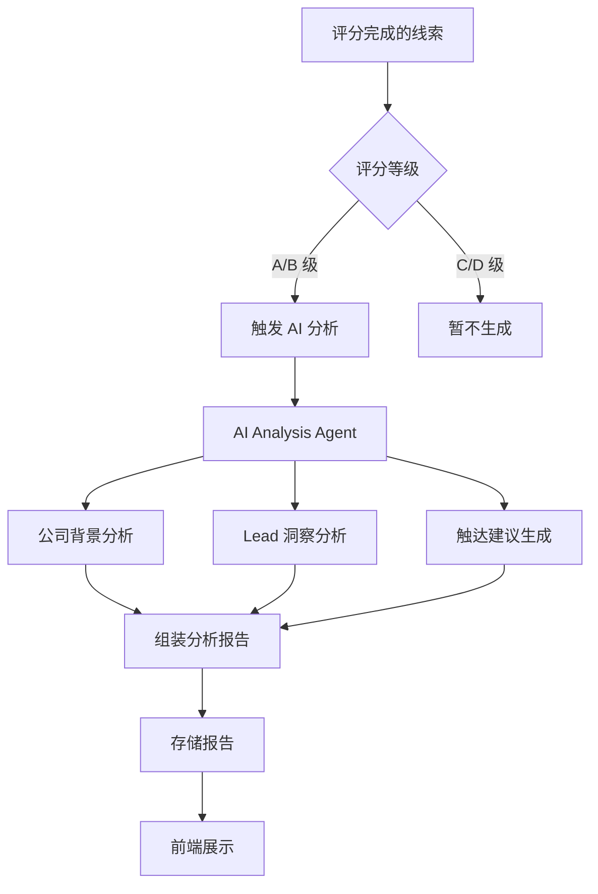

# AI 分析报告模块

## 功能目标

为每个高优先级线索自动生成 AI 分析报告，帮助用户在联系客户前快速了解目标公司和决策人的背景，并提供个性化的触达建议。

## 报告生成流程



## 报告内容结构

### 1. 公司分析摘要

| 内容 | 说明 |
|------|------|
| **公司概况** | 一段话概括公司做什么、服务谁、处于什么阶段 |
| **业务亮点** | 近期融资、业务扩张、技术升级等正面信号 |
| **潜在需求** | 基于行业+规模+招聘信号推测的可能需求 |
| **风险提示** | 经营异常、诉讼、负面新闻等需注意的信息 |

### 2. Lead 洞察

| 内容 | 说明 |
|------|------|
| **角色定位** | 该 Lead 在采购决策中扮演什么角色 |
| **背景概要** | 职业履历、专业领域、可能的关注点 |
| **沟通建议** | 基于 Lead 背景推荐的沟通切入点 |

### 3. 触达建议

| 内容 | 说明 |
|------|------|
| **推荐渠道** | 邮件/电话/微信/LinkedIn（基于联系方式完整度） |
| **推荐时机** | 建议联系的时间窗口 |
| **话术要点** | 基于公司需求和 Lead 背景的个性化沟通要点 |
| **注意事项** | 需要避免的话题或特别注意的点 |

## Dify Agent 设计

### AI Analysis Agent

| 配置 | 说明 |
|------|------|
| **Agent 类型** | 工具型 Agent（非对话） |
| **输入** | 公司详情 + Lead 信息 + ICP + 评分结果 |
| **输出** | 结构化分析报告 JSON |
| **知识库** | B2B 销售方法论、话术模版、行业分析 |
| **LLM** | GPT-4 / Claude（需要强推理能力） |

### 输出示例

```json
{
  "company_analysis": {
    "summary": "XX科技是一家成立5年的企业服务SaaS公司...",
    "highlights": ["2024年完成B轮融资", "正在扩招销售团队"],
    "potential_needs": ["销售效率提升工具", "客户管理系统升级"],
    "risks": []
  },
  "lead_insight": {
    "role_assessment": "决策者，直接负责销售工具采购",
    "background": "10年销售管理经验，关注销售效率和数据驱动",
    "talking_points": ["销售团队扩张带来的管理挑战", "数据驱动的获客策略"]
  },
  "outreach_suggestion": {
    "channel": "邮件+LinkedIn",
    "timing": "工作日上午 9-11 点",
    "key_message": "针对销售团队扩张场景，展示如何提升SDR效率",
    "avoid": ["不要强推产品功能", "避免价格导向话术"]
  }
}
```

## MVP 边界

- MVP 阶段仅对 A/B 级线索生成分析报告
- 报告为只读展示，不支持编辑
- 触达建议为参考性质，不自动执行触达
- 后续版本可基于用户反馈优化报告质量

## 功能要点

- [ ] AI Analysis Agent 开发
- [ ] 公司分析摘要生成
- [ ] Lead 洞察分析生成
- [ ] 触达建议生成
- [ ] 报告展示页面
- [ ] 报告导出（PDF）
