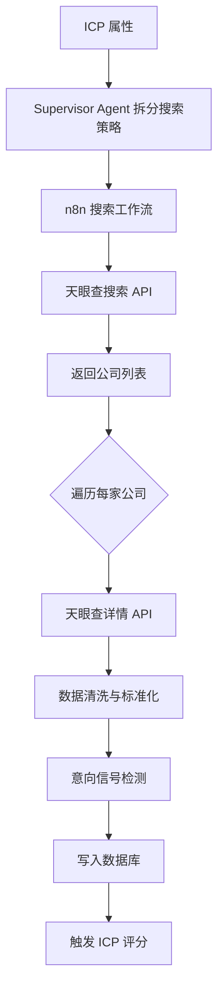

# 公司搜索模块

## 功能目标

基于 ICP 拆分出的搜索属性，通过天眼查 API 多维度搜索目标企业，自动获取公司详细信息并存储到数据库。

## 搜索流程



## 搜索维度

基于 ICP 自动映射为天眼查搜索参数：

| ICP 属性 | 搜索参数 | 天眼查 API 字段 |
|----------|----------|----------------|
| 行业 | 行业分类代码 | `industryCode` |
| 地区 | 省市区代码 | `areaCode` |
| 规模 | 员工数范围 | `employeeRange` |
| 注册资本 | 资本范围 | `capitalRange` |
| 成立时间 | 成立年份范围 | `foundedRange` |
| 关键词 | 经营范围/名称 | `keyword` |

## 数据来源

### 天眼查搜索 API

**用途**：根据筛选条件批量搜索公司列表

**请求参数**：
- 关键词（行业/产品）
- 地区筛选
- 规模筛选
- 分页参数

### 天眼查详情 API

**用途**：获取单个公司的完整信息

**返回数据**：工商信息、股东、融资记录、招聘信息、新闻等

## 搜索结果字段

每家公司存储以下 28 个字段：

| 分类 | 字段 |
|------|------|
| **基础信息** | 公司名称、统一社会信用代码、法定代表人、成立日期、注册资本 |
| **经营信息** | 经营状态、经营范围、所属行业、企业类型 |
| **规模信息** | 员工数量、参保人数、年营收范围 |
| **地理信息** | 注册地址、省、市、区 |
| **融资信息** | 最新融资轮次、融资金额、融资时间、投资方 |
| **信号字段** | 招聘活跃度、近期新闻数、技术栈标签、社交活跃度 |
| **系统字段** | 数据来源、抓取时间、ICP 评分、所属搜索会话 ID |

## n8n 工作流设计

```
┌────────────┐    ┌──────────────┐    ┌──────────────┐
│ 接收搜索   │───→│ 天眼查搜索   │───→│ 遍历结果     │
│ 任务参数   │    │ API 调用     │    │ 逐条处理     │
└────────────┘    └──────────────┘    └──────┬───────┘
                                             │
                  ┌──────────────┐    ┌──────┴───────┐
                  │ 写入         │←───│ 天眼查详情   │
                  │ 数据库       │    │ API 调用     │
                  └──────┬───────┘    └──────────────┘
                         │
                  ┌──────┴───────┐
                  │ 回调 Dify    │
                  │ 触发评分     │
                  └──────────────┘
```

## 附加功能

- **相似企业推荐（Lookalike）**：输入一家标杆客户，AI 分析其特征并推荐相似企业
- **搜索历史**：保存搜索条件和结果，支持回溯
- **批量操作**：批量加入线索池、批量导出

## 功能要点

- [ ] ICP 属性自动映射为搜索参数
- [ ] 天眼查搜索 API 集成
- [ ] 天眼查详情 API 集成
- [ ] 搜索结果存储到数据库
- [ ] 搜索结果列表展示
- [ ] 相似企业推荐
- [ ] 搜索历史保存
