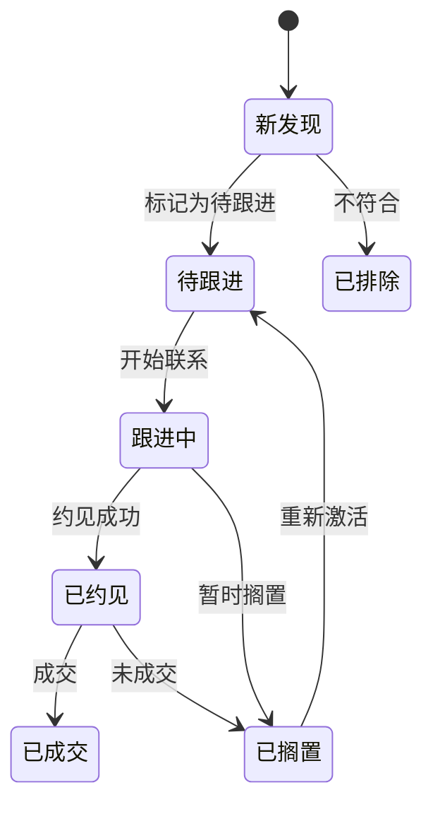

# CRM 与数据管理模块

## 功能目标

在产品站内提供轻量级的 CRM 功能，让用户能够管理搜索到的线索、追踪跟进状态、组织和导出数据。MVP 阶段不对接外部 CRM 系统，后续版本再扩展。

## 核心功能

### 1. 线索列表管理

**线索状态流转**：



**列表视图功能**：
- 按 ICP 评分排序
- 按状态筛选
- 按公司/行业/地区筛选
- 关键词搜索
- 批量操作（批量修改状态、批量导出）

### 2. 线索详情页

| 信息区块 | 内容 |
|----------|------|
| **公司信息** | 公司名称、行业、规模、融资、ICP 评分等 |
| **联系人列表** | 该公司下的所有 Lead 及其评分 |
| **AI 分析报告** | 公司分析 + Lead 洞察 + 触达建议 |
| **跟进记录** | 用户手动添加的跟进备注和时间线 |
| **操作区** | 修改状态、添加备注、导出 |

### 3. 搜索数据管理

| 功能 | 说明 |
|------|------|
| **搜索会话历史** | 查看所有历史搜索，包括使用的 ICP 和搜索条件 |
| **搜索结果管理** | 每次搜索结果独立管理，可选择性加入线索池 |
| **数据统计** | 各次搜索的命中数、评分分布、加入线索池比例 |

### 4. 数据导入/导出

**导出**：
- 支持导出为 CSV / Excel
- 可选导出字段
- 支持按筛选条件导出

**导入**：
- 支持 CSV / Excel 导入现有线索
- 自动字段映射
- 去重检测（基于公司名 + 联系人姓名）

### 5. 跟进备注

- 用户可为每个线索添加文字备注
- 备注按时间线展示
- 支持标记下次跟进日期

## 页面结构

```
CRM 管理
├── 线索列表（全部线索，支持筛选排序）
│   ├── 线索详情页
│   │   ├── 公司信息
│   │   ├── 联系人列表
│   │   ├── AI 分析报告
│   │   └── 跟进记录
│   └── 批量操作
├── 搜索历史（按搜索会话组织）
│   └── 搜索结果管理
├── 数据导入
└── 数据导出
```

## 未来扩展（非 MVP）

- 外部 CRM 集成（纷享销客、销售易、Salesforce）
- 双向数据同步
- 自定义字段
- 团队协作（线索分配、权限管理）
- 自动化提醒（跟进日期提醒）

## 功能要点

- [ ] 线索列表页（筛选、排序、搜索）
- [ ] 线索详情页
- [ ] 状态流转功能
- [ ] 跟进备注功能
- [ ] 搜索历史管理
- [ ] CSV/Excel 导出
- [ ] CSV/Excel 导入
- [ ] 数据去重
