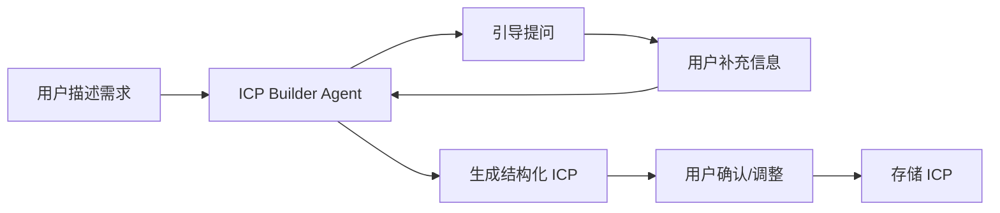

# ICP 构建模块

## 功能目标

帮助用户定义或导入理想客户画像（ICP），作为后续所有搜索、评分、分析的核心驱动依据。ICP 是整个 LeadKits 产品的起点和基石。

## 两种构建模式

### 模式 1：AI 对话构建

适用于没有明确 ICP 的用户。通过 Dify ICP Builder Agent 引导式对话，逐步帮助用户梳理出结构化的 ICP。



**Agent 引导逻辑**：
1. 询问用户的产品/服务是什么
2. 询问目标客户的行业和规模
3. 询问理想决策人的职位和角色
4. 询问客户的关键痛点和购买信号
5. 基于知识库补充行业采购链信息
6. 输出结构化 ICP

**知识库支撑**：
- ICP 最佳实践知识库
- 行业采购结构链知识库
- 行业与产业关联知识库
- B2B 销售方法论知识库

### 模式 2：直接上传

适用于已有 ICP 的用户。支持上传文件或粘贴文本，系统自动解析为结构化格式。

**支持格式**：
- 文本描述（自由格式，AI 解析）
- 结构化表格（CSV/Excel）
- JSON 格式

## ICP 属性维度

### 公司维度

| 属性 | 说明 | 示例 |
|------|------|------|
| 行业 | 国标行业分类 | 企业服务、电商、教育 |
| 地区 | 省/市/区 | 北京、上海、深圳 |
| 规模 | 员工数量范围 | 50-200 人 |
| 注册资本 | 注册资本范围 | 100 万-1000 万 |
| 成立时间 | 成立年限 | 3-10 年 |
| 融资阶段 | 最新融资轮次 | A 轮、B 轮 |
| 技术栈 | 使用的技术/工具 | React、AWS、Salesforce |
| 招聘信号 | 是否在招聘相关岗位 | 招聘销售总监 |

### 联系人维度

| 属性 | 说明 | 示例 |
|------|------|------|
| 职位 | 目标决策人职位 | CEO、CTO、VP Sales |
| 部门 | 所属部门 | 销售部、技术部、市场部 |
| 决策层级 | 在采购决策中的角色 | 决策者、影响者、使用者 |
| 关键词 | 职位描述中的关键词 | 数字化转型、增长 |

## Dify Agent 设计

### ICP Builder Agent

| 配置 | 说明 |
|------|------|
| **Agent 类型** | 对话型 Agent |
| **LLM** | GPT-4 / Claude（可配置） |
| **System Prompt** | 引导用户构建 ICP 的专业顾问角色 |
| **知识库** | ICP 最佳实践、行业采购结构链、行业分类 |
| **输出格式** | 结构化 JSON（含公司维度 + 联系人维度） |
| **工具调用** | 无（纯对话生成） |

### 输出示例

```json
{
  "icp_name": "企业服务 SaaS 中型企业",
  "company": {
    "industry": ["企业服务", "SaaS"],
    "region": ["北京", "上海", "深圳"],
    "employee_range": [50, 500],
    "funding_stage": ["A轮", "B轮", "C轮"],
    "founded_years_min": 3,
    "keywords": ["数字化", "云服务"]
  },
  "contact": {
    "titles": ["CTO", "VP Engineering", "技术总监"],
    "departments": ["技术部", "研发部"],
    "decision_level": "决策者"
  }
}
```

## 功能要点

- [ ] AI 对话构建 ICP
- [ ] 文件上传导入 ICP
- [ ] ICP 编辑与调整
- [ ] ICP 保存与复用（支持多个 ICP）
- [ ] ICP 属性 → 搜索条件的自动映射
