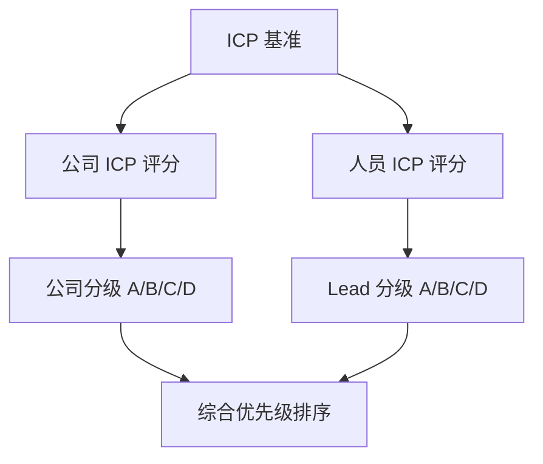

# ICP 评分模块

## 功能目标

基于用户定义的 ICP，对搜索到的公司和 Lead 进行智能匹配评分。帮助用户快速识别高价值目标，优先投入精力在最有可能转化的线索上。

## 评分体系

### 双维度评分



### 公司 ICP 评分

| 评分维度 | 权重（默认） | 评分逻辑 |
|----------|-------------|----------|
| 行业匹配 | 25% | 完全匹配 100 分，关联行业 60 分，不匹配 0 分 |
| 地区匹配 | 15% | 完全匹配 100 分，同省 60 分，不匹配 0 分 |
| 规模匹配 | 20% | 在 ICP 范围内 100 分，偏差 ±50% 为 60 分 |
| 融资匹配 | 15% | 轮次匹配 100 分，相邻轮次 70 分 |
| 意向信号 | 25% | 基于招聘、融资、技术选型等信号综合判断 |

**意向信号详细评估**：

| 信号 | 含义 | 加分 |
|------|------|------|
| 近期完成融资 | 有预算，可能扩展采购 | +20 |
| 招聘相关岗位 | 有对应需求 | +15 |
| 技术栈匹配 | 技术兼容性高 | +10 |
| 近期负面新闻少 | 经营状况稳定 | +5 |
| 员工增长 | 业务扩张中 | +10 |

### 人员 ICP 评分

| 评分维度 | 权重（默认） | 评分逻辑 |
|----------|-------------|----------|
| 职位匹配 | 35% | 完全匹配 100 分，相关职位 60 分 |
| 部门匹配 | 20% | 完全匹配 100 分 |
| 决策层级 | 25% | 决策者 100 分，影响者 70 分，使用者 40 分 |
| 联系方式完整度 | 20% | 手机+邮箱 100 分，仅邮箱 60 分，无联系方式 10 分 |

## 自动分级

| 等级 | 分数范围 | 含义 | 建议操作 |
|------|----------|------|----------|
| **A 级** | 85-100 | 高度匹配，强购买信号 | 立即跟进 |
| **B 级** | 70-84 | 较好匹配，有潜力 | 优先跟进 |
| **C 级** | 50-69 | 部分匹配，待观察 | 持续培育 |
| **D 级** | 0-49 | 匹配度低 | 暂不跟进 |

## Dify Agent 设计

### ICP Scoring Agent

| 配置 | 说明 |
|------|------|
| **Agent 类型** | 工具型 Agent（非对话） |
| **输入** | ICP 基准 JSON + 公司/Lead 数据 JSON |
| **输出** | 各维度得分 + 总分 + 等级 + 评分理由 |
| **LLM 角色** | 判断意向信号、评估匹配度中的模糊匹配 |
| **规则引擎** | 行业/地区/规模等硬指标用规则计算，不走 LLM |

### 评分输出示例

```json
{
  "company_score": {
    "total": 82,
    "grade": "B",
    "breakdown": {
      "industry": 100,
      "region": 60,
      "scale": 80,
      "funding": 70,
      "intent_signals": 90
    },
    "reasoning": "行业完全匹配，地区为同省非目标城市；近期完成A轮融资，正在招聘技术总监，购买意向较强"
  }
}
```

## 功能要点

- [ ] 公司 ICP 评分算法
- [ ] 人员 ICP 评分算法
- [ ] 评分规则可自定义（权重调整）
- [ ] 自动分级与标记
- [ ] 评分理由展示
- [ ] 批量重新评分（ICP 修改后）
