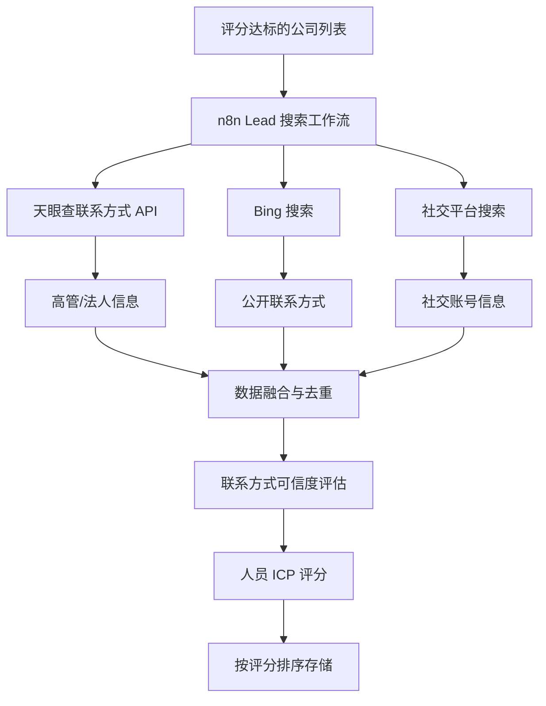
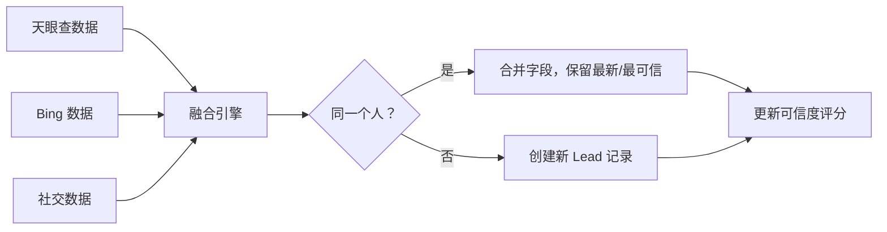

# Lead 发现模块

## 功能目标

在搜索到目标企业后，找到企业内的关键决策人及其联系方式。通过天眼查、网络搜索、社交平台等多渠道交叉验证，获取最完整准确的联系人信息。

## 搜索流程

## 搜索渠道

### 渠道 1：天眼查联系方式 API

| 维度 | 说明 |
|------|------|
| **获取内容** | 企业高管姓名、职位、手机号、邮箱 |
| **数据质量** | 高（工商注册信息来源） |
| **覆盖范围** | 法定代表人、主要高管 |
| **限制** | 部分联系方式可能过期 |

### 渠道 2：Bing 搜索

| 维度 | 说明 |
|------|------|
| **获取内容** | 公开的联系信息、邮箱、社交主页 |
| **搜索策略** | `"公司名" + "职位" + "联系方式/邮箱"` |
| **数据质量** | 中（需要验证） |
| **覆盖范围** | 公开信息较多的联系人 |

### 渠道 3：社交平台

| 维度 | 说明 |
|------|------|
| **获取内容** | LinkedIn 主页、微信公众号、知乎等 |
| **数据质量** | 中（社交信息，需人工确认） |
| **MVP 范围** | 仅做信息展示，不做自动化触达 |

## 联系人字段

每个 Lead 存储以下 22 个字段：

| 分类 | 字段 |
|------|------|
| **基础信息** | 姓名、性别、职位、部门 |
| **联系方式** | 手机号码、企业邮箱、个人邮箱 |
| **社交账号** | LinkedIn URL、微信号、其他社交主页 |
| **职业信息** | 任职公司、任职时长、职业履历摘要 |
| **评分字段** | ICP 匹配分、决策层级评估、联系方式可信度 |
| **关联字段** | 所属公司 ID、数据来源、发现渠道 |
| **系统字段** | 创建时间、更新时间、状态（新发现/已联系/已跟进） |

## 数据融合逻辑

多渠道获取的联系人数据需要融合处理：

**去重规则**：
1. 姓名 + 公司名称 完全匹配 → 同一人
2. 手机号 / 邮箱 匹配 → 同一人
3. 姓名相似 + 职位相近 → 疑似同一人（标记待人工确认）

## 合规要求

- 仅采集公开可获取的信息
- 符合《个人信息保护法》要求
- 提供数据来源溯源说明
- 支持联系人提出删除请求（DSAR）
- 不存储身份证号、银行卡号等敏感个人信息

## 功能要点

- [ ] 天眼查联系方式 API 集成
- [ ] Bing 搜索 Lead 信息
- [ ] 多渠道数据融合与去重
- [ ] 联系方式可信度评估
- [ ] Lead 列表展示与筛选
- [ ] Lead 详情页
