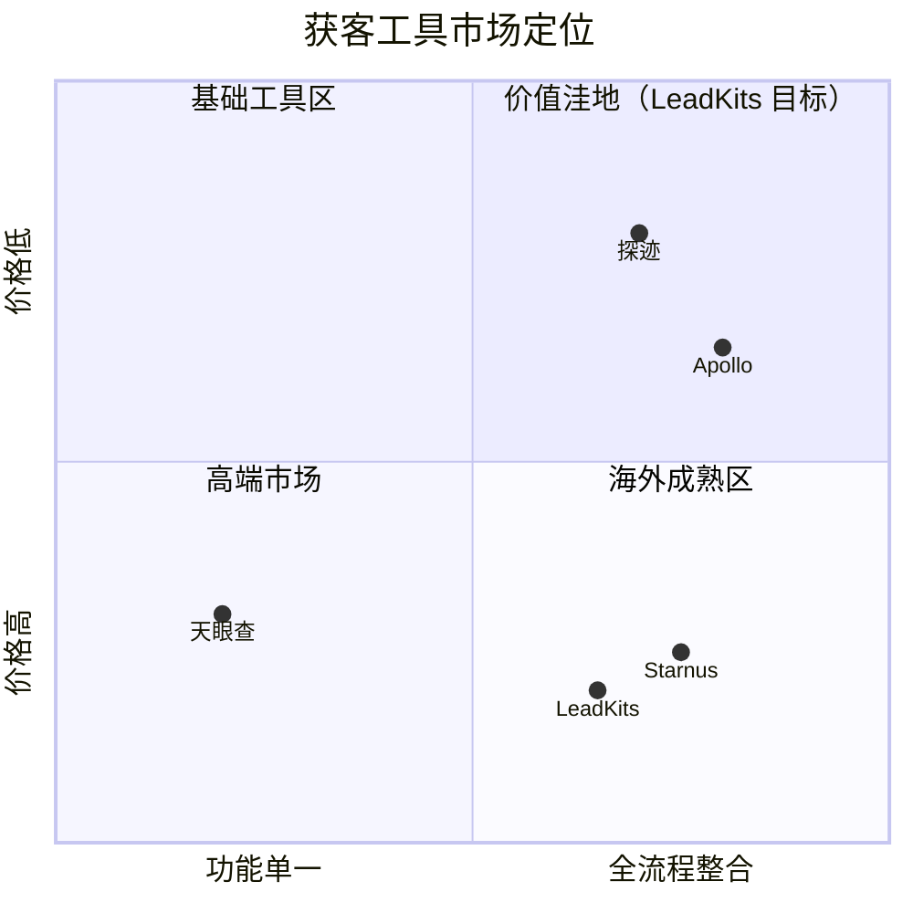

# 市场分析

## 市场背景

国内 B2B SaaS 市场持续增长，但在营销获客工具领域存在明显的供给缺口：

- **海外工具**（Apollo、Starnus 等）功能成熟，但国内数据覆盖差，不支持微信/钉钉等本土渠道
- **国内高端工具**（探迹等）数据好但价格高，年费数万起步，中小团队难以负担
- **基础查询工具**（天眼查/企查查）数据全面但只做查询，没有获客流程整合

中小 B2B 团队迫切需要一款**低成本 + 全流程 + 智能化**的本土获客工具。

## 竞品分析

### 直接竞品

| 产品 | 定位 | 核心能力 | 优势 | 不足 | 价格 |
|------|------|----------|------|------|------|
| Starnus | 海外一站式外呼 | ICP→搜索→触达→会议 | 全流程整合、价格低 | 不支持国内渠道、国内数据差 | €20/月起 |
| Apollo.io | 海外 B2B 数据平台 | 海量数据库+序列自动化 | 数据库 2.75 亿联系人、功能成熟 | 国内数据覆盖极差、价格高 | $49/月起 |
| 探迹 | 国内智能销售 | AI 线索推荐+外呼 | 本土数据好、AI 能力强 | 价格高、主要服务中大企业 | 年费数万 |

### 间接竞品

| 产品 | 定位 | 与 LeadKits 的关系 |
|------|------|-------------------|
| 天眼查/企查查 | 企业信息查询 | 数据来源，非竞争关系 |
| 纷享销客/销售易 | CRM 系统 | 下游工具，未来可集成 |
| Clay | 海外数据富化平台 | 功能参考，但面向海外市场 |

## 差异化定位

**LeadKits 的核心差异化**：
1. **ICP 驱动**：不是简单搜索，而是以 ICP 为起点的智能获客
2. **本土数据 + 本土渠道**：天眼查数据 + 未来微信/钉钉触达
3. **AI 原生**：Dify Agent 驱动的智能评分和分析，不只是查询工具
4. **低成本**：面向中小团队，定价亲民

## 市场机会

1. **工具整合需求强烈**：中小 B2B 团队平均使用 3-5 个工具完成获客，愿意为一站式工具付费
2. **AI 降低使用门槛**：通过 AI Agent 把专业 SDR 的工作流程产品化，让非销售背景的创始人也能高效获客
3. **国内空白市场**：低价位 + 全流程 + 国内数据的组合，目前没有直接竞品
