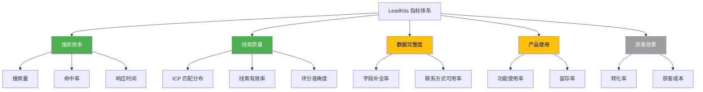

# 指标体系

## 概述

LeadKits 的指标体系分为 5 大板块，覆盖从搜索到转化的全链路。MVP 阶段重点关注搜索效率和线索质量两大核心指标，其他指标随功能迭代逐步建设。

## 指标总览



> 🟢 MVP 核心指标 | 🟡 MVP 辅助指标 | ⚪ 未来指标

---

## 1. 搜索效率指标 🟢

衡量搜索功能的效率和质量。

| 指标 | 定义 | 计算方式 | MVP 目标 |
|------|------|----------|----------|
| **搜索次数** | 用户发起的搜索总次数 | COUNT(search_sessions) | 监控，无目标值 |
| **单次搜索结果数** | 每次搜索返回的公司数量 | AVG(result_count) | 20-100 条 |
| **搜索命中率** | 搜索结果中评分 ≥ B 级的比例 | B+以上 / 总结果 | > 30% |
| **搜索响应时间** | 从发起搜索到结果展示的时间 | P95 latency | < 30 秒 |
| **搜索完成率** | 搜索任务成功完成的比例 | 成功 / 总数 | > 95% |

### 搜索命中率分析

搜索命中率是衡量 ICP → 搜索策略转化质量的核心指标：

| 命中率区间 | 判断 | 可能原因 |
|-----------|------|----------|
| > 50% | 优秀 | ICP 定义精准，搜索策略有效 |
| 30%-50% | 良好 | 正常水平 |
| 10%-30% | 待优化 | ICP 可能过宽，或搜索关键词需调整 |
| < 10% | 需关注 | ICP 定义有问题，或数据源覆盖不足 |

---

## 2. 线索质量指标 🟢

衡量搜索产出的线索质量。

| 指标 | 定义 | 计算方式 | MVP 目标 |
|------|------|----------|----------|
| **ICP 匹配度分布** | A/B/C/D 各等级的线索占比 | 各等级 COUNT / 总数 | A+B 级 > 30% |
| **线索有效率** | 用户标记为「待跟进」及以上的比例 | 有效标记 / 总生成 | > 20% |
| **评分准确度** | 用户实际操作与评分等级的一致性 | A 级线索被跟进的比例 | > 60% |
| **Lead 发现率** | 每家公司找到的联系人数量 | AVG(leads per company) | ≥ 2 人 |

### 线索分级分布目标

```
理想分布：
  A 级: 10-15%  ██████████
  B 级: 20-25%  ████████████████████
  C 级: 35-40%  ████████████████████████████████████
  D 级: 20-35%  ████████████████████████████
```

---

## 3. 数据完整度指标 🟡

衡量数据富化和联系方式获取的质量。

| 指标 | 定义 | 计算方式 | MVP 目标 |
|------|------|----------|----------|
| **公司字段补全率** | 28 个公司字段中有值的比例 | 非空字段 / 总字段 | > 70% |
| **联系方式可用率** | Lead 有至少 1 种联系方式的比例 | 有联系方式 / 总 Lead | > 80% |
| **邮箱获取率** | Lead 中有邮箱的比例 | 有邮箱 / 总 Lead | > 50% |
| **手机获取率** | Lead 中有手机号的比例 | 有手机 / 总 Lead | > 40% |
| **多源覆盖率** | Lead 被 2 个以上渠道覆盖的比例 | 多源 / 总 Lead | > 30% |

---

## 4. 产品使用指标 🟡

衡量用户对产品的使用情况和粘性。

| 指标 | 定义 | 计算方式 | MVP 目标 |
|------|------|----------|----------|
| **DAU/MAU** | 日活/月活用户数 | 唯一用户数 | 监控趋势 |
| **ICP 创建数** | 用户创建的 ICP 数量 | COUNT(icp_profiles) | 人均 ≥ 2 |
| **搜索频率** | 每用户每周搜索次数 | 搜索数 / 活跃用户 / 周 | ≥ 2 次 |
| **线索操作率** | 用户对搜索结果有操作的比例 | 有状态变更 / 总线索 | > 40% |
| **导出率** | 用户导出数据的比例 | 导出会话 / 总会话 | > 20% |
| **7 日留存率** | 注册后第 7 天仍活跃 | 第 7 天活跃 / 注册数 | > 30% |

---

## 5. 获客效果指标 ⚪（未来）

V1.0+ 版本加入触达功能后启用。

| 指标 | 定义 | 说明 |
|------|------|------|
| **触达率** | 成功发送消息的比例 | 需要邮件/微信触达功能 |
| **回复率** | 收到回复的比例 | 衡量触达质量 |
| **约见转化率** | 从线索到约见的转化 | 核心漏斗指标 |
| **获客成本 (CAC)** | 获取一个约见的成本 | 工具费用 + API 费用 |
| **渠道 ROI** | 各渠道的投入产出比 | 优化渠道分配 |

---

## 数据看板（MVP）

MVP 阶段在产品中提供基础数据看板：

### 搜索概览

- 总搜索次数
- 本周搜索趋势
- 各次搜索的命中率对比

### 线索概览

- 线索总数及各状态分布
- ICP 评分等级分布（饼图）
- 近期新增线索趋势

### ICP 效果

- 各 ICP 的搜索命中率对比
- 各 ICP 的线索质量分布

## 数据采集方式

| 数据来源 | 采集方式 | 存储 |
|----------|----------|------|
| 搜索行为 | search_sessions 表 | PostgreSQL |
| 线索操作 | companies/leads 状态变更 | PostgreSQL |
| 评分数据 | company_scores/lead_scores 表 | PostgreSQL |
| 用户行为 | 前端埋点（未来） | 待定 |
