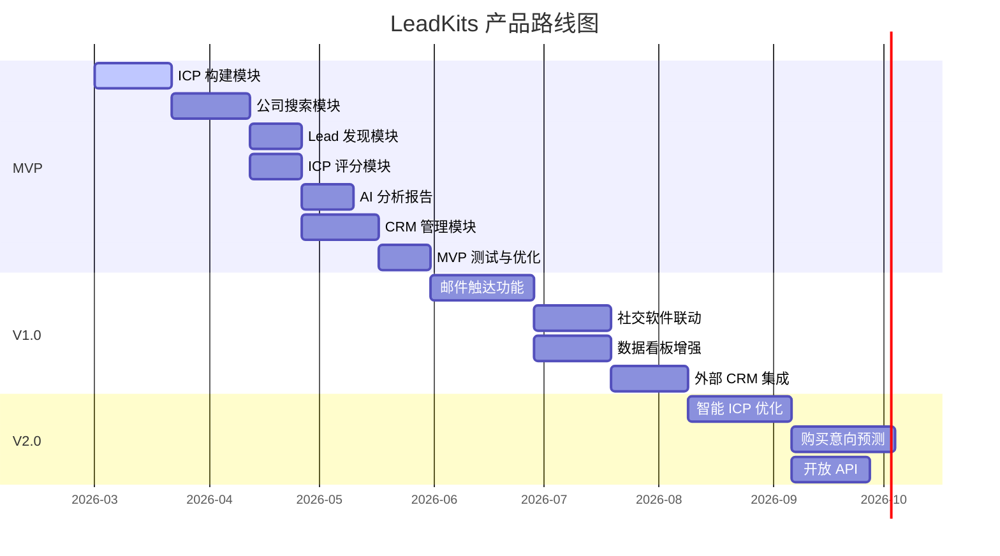

# 产品路线图

## 版本规划总览

---

## MVP (v0.1) — 核心获客闭环

**目标**：跑通从 ICP 定义到线索获取的完整闭环，验证产品核心价值。

### 功能范围

| 模块 | 功能 | 优先级 |
|------|------|--------|
| **ICP 构建** | AI 对话构建 ICP | P0 |
| | 上传/导入 ICP | P0 |
| | ICP 编辑与保存 | P0 |
| **公司搜索** | 天眼查搜索 API 集成 | P0 |
| | 天眼查详情 API 集成 | P0 |
| | 搜索结果列表展示 | P0 |
| **Lead 发现** | 天眼查联系方式 API | P0 |
| | Bing 搜索 Lead | P1 |
| | 多源数据融合 | P1 |
| **ICP 评分** | 公司 ICP 评分 | P0 |
| | Lead ICP 评分 | P0 |
| | 自动分级 | P0 |
| **AI 分析** | 公司分析摘要 | P1 |
| | 触达建议生成 | P1 |
| **CRM 管理** | 线索列表管理 | P0 |
| | 状态流转 | P0 |
| | CSV 导出 | P1 |
| | 跟进备注 | P1 |

### 技术里程碑

| 里程碑 | 内容 | 状态 |
|--------|------|------|
| M1 | 项目初始化（Next.js + DB + Dify + n8n 环境搭建） | 🔜 即将开始 |
| M2 | ICP Builder Agent 开发 + 前端页面 | ⏳ 待开始 |
| M3 | 公司搜索工作流 + 天眼查 API 对接 | ⏳ 待开始 |
| M4 | ICP Scoring Agent + Lead 搜索工作流 | ⏳ 待开始 |
| M5 | AI Analysis Agent + CRM 管理页面 | ⏳ 待开始 |
| M6 | 联调测试 + Bug 修复 + 优化 | ⏳ 待开始 |

### MVP 验证指标

| 指标 | 目标 | 验证方式 |
|------|------|----------|
| 搜索命中率 | > 30% | 搜索 B 级以上占比 |
| 端到端流程完成率 | > 80% | 从 ICP → 线索列表无中断 |
| 单次搜索时间 | < 60 秒 | 50 家公司搜索+评分 |
| 用户可获得的线索数 | > 20 条/次 | 有效联系方式的线索 |

---

## V1.0 — 触达能力与数据增强

**目标**：在 MVP 的基础上，增加触达能力和数据分析能力，形成完整的获客闭环。

### 新增功能

| 功能 | 说明 |
|------|------|
| **邮件触达** | AI 生成个性化邮件、发送与追踪 |
| **社交软件联动** | 企业微信 / LinkedIn 消息（基础集成） |
| **序列自动化** | 多步骤触达序列（邮件 → 微信 → 跟进） |
| **数据看板增强** | 搜索分析、线索漏斗、触达效果分析 |
| **外部 CRM 集成** | 对接纷享销客 / 销售易 / Salesforce |
| **数据富化增强** | 更多数据源（招聘平台、新闻舆情） |

---

## V2.0 — 智能化升级

**目标**：基于用户使用数据，实现更深层的智能化，提升获客精准度和效率。

### 新增功能

| 功能 | 说明 |
|------|------|
| **智能 ICP 优化** | 基于成交数据自动优化 ICP 参数 |
| **购买意向预测** | 综合多维信号预测购买概率 |
| **智能序列优化** | 自动调整触达策略、时间、话术 |
| **相似客户推荐** | 基于已成交客户推荐相似潜在客户 |
| **开放 API** | 提供 API 供第三方集成 |
| **团队协作** | 多用户、线索分配、权限管理 |

---

## 技术债务管理

### MVP 阶段已知技术债

| 技术债 | 说明 | 计划解决版本 |
|--------|------|-------------|
| 无用户体系 | MVP 可能先不做完整用户认证 | V1.0 |
| 搜索性能 | 顺序调用 API，未做并行优化 | V1.0 |
| 错误处理 | 基础异常处理，缺少自动重试 | V1.0 |
| 监控缺失 | 无系统化监控 | V1.0 |
| 测试覆盖 | MVP 阶段测试不充分 | V1.0 |
