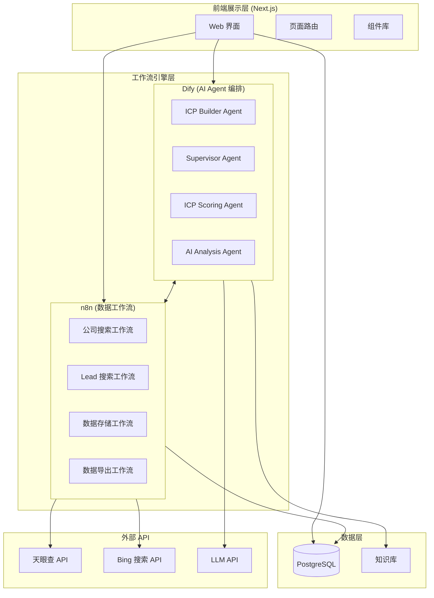
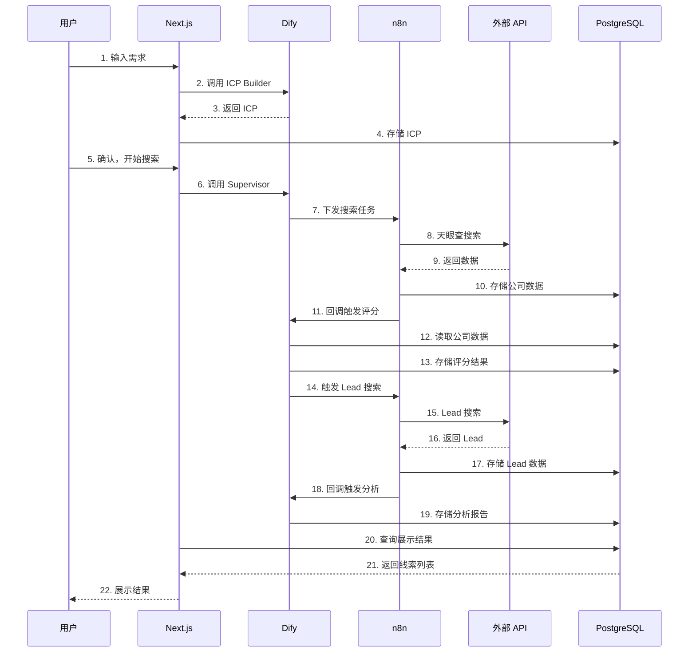

# 系统架构

## 架构总览

LeadKits 采用三层架构：前端展示层、工作流引擎层、数据层，通过 Dify（AI 编排）和 n8n（数据工作流）实现业务逻辑。



## 组件职责

### 前端层 (Next.js)

| 组件 | 职责 |
|------|------|
| **Web 界面** | 用户交互界面，响应式设计 |
| **App Router** | 页面路由管理 |
| **API Routes** | 轻量 BFF 层，转发请求到 Dify/n8n |
| **状态管理** | 前端数据状态（线索列表、筛选条件等） |

### 工作流引擎层

#### Dify — AI Agent 编排

负责所有需要 LLM 参与的智能处理：

| Agent | 职责 | 调用方式 |
|-------|------|----------|
| **ICP Builder** | 对话式 ICP 构建 | 前端直接调用 Dify API |
| **Supervisor** | 解析 ICP，拆分搜索任务 | 前端调用，输出任务给 n8n |
| **ICP Scoring** | 公司和 Lead 的 ICP 匹配评分 | n8n 回调触发 |
| **AI Analysis** | 生成分析报告和触达建议 | 评分完成后触发 |

#### n8n — 数据工作流

负责所有数据获取、处理、存储的自动化流程：

| 工作流 | 职责 | 触发方式 |
|--------|------|----------|
| **公司搜索** | 调用天眼查 API 搜索+获取详情 | Supervisor 下发任务 |
| **Lead 搜索** | 多渠道搜索联系人 | 公司评分完成后触发 |
| **数据存储** | 清洗、去重、写入数据库 | 搜索结果返回后 |
| **数据导出** | 生成 CSV/Excel 导出文件 | 用户手动触发 |

### 数据层

| 组件 | 用途 |
|------|------|
| **PostgreSQL** | 核心业务数据存储（公司、Lead、ICP、会话） |
| **知识库（Dify）** | Dify 内置向量知识库，支撑 Agent 的行业知识 |

## 数据流向



## 部署架构

```
┌──────────────────────────────────────────┐
│              部署环境                      │
├──────────┬──────────┬──────────┬─────────┤
│ Next.js  │   Dify   │   n8n   │ Postgres │
│ (Vercel/ │ (Docker) │ (Docker)│ (Docker/ │
│  Docker) │          │         │  Cloud)  │
└──────────┴──────────┴──────────┴─────────┘
```

**MVP 部署方案**：
- Next.js：Vercel 或 Docker
- Dify：Docker 自部署
- n8n：Docker 自部署
- PostgreSQL：Docker 或云数据库（阿里云 RDS）
