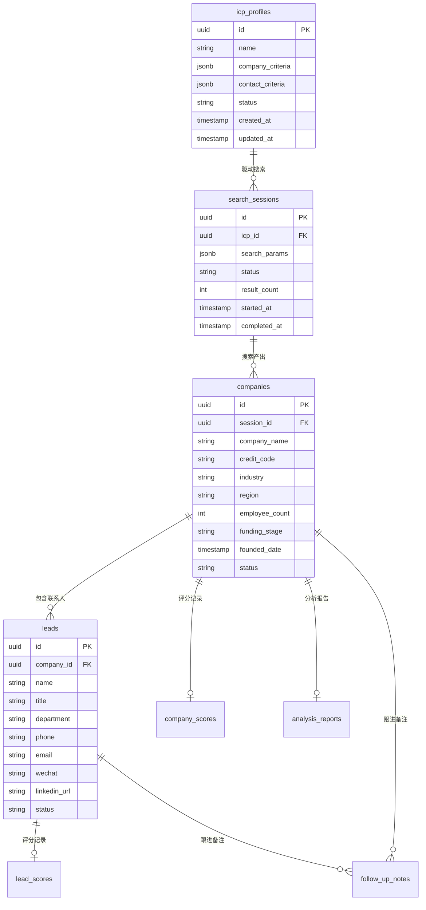

# 数据库设计

## 概述

使用 PostgreSQL 作为核心数据存储，通过 Prisma ORM 管理数据模型。

## ER 关系图



## 数据表详细设计

### 1. icp_profiles — ICP 画像表

| 字段 | 类型 | 必填 | 说明 |
|------|------|------|------|
| id | UUID | 是 | 主键 |
| name | VARCHAR(100) | 是 | ICP 名称 |
| description | TEXT | 否 | ICP 描述 |
| company_criteria | JSONB | 是 | 公司维度条件 |
| contact_criteria | JSONB | 是 | 联系人维度条件 |
| source | VARCHAR(20) | 是 | 来源：ai_built / uploaded |
| status | VARCHAR(20) | 是 | active / archived |
| created_at | TIMESTAMP | 是 | 创建时间 |
| updated_at | TIMESTAMP | 是 | 更新时间 |

**company_criteria JSONB 结构**：
```json
{
  "industry": ["企业服务", "SaaS"],
  "region": ["北京", "上海"],
  "employee_range": [50, 500],
  "capital_range": [1000000, 10000000],
  "funding_stage": ["A轮", "B轮"],
  "founded_years_min": 3,
  "keywords": ["数字化", "云服务"]
}
```

### 2. search_sessions — 搜索会话表

| 字段 | 类型 | 必填 | 说明 |
|------|------|------|------|
| id | UUID | 是 | 主键 |
| icp_id | UUID | 是 | 关联 ICP |
| search_params | JSONB | 是 | 实际搜索参数 |
| status | VARCHAR(20) | 是 | pending / searching / scoring / completed / failed |
| result_count | INT | 否 | 搜索结果数 |
| a_count | INT | 否 | A 级线索数 |
| b_count | INT | 否 | B 级线索数 |
| c_count | INT | 否 | C 级线索数 |
| d_count | INT | 否 | D 级线索数 |
| started_at | TIMESTAMP | 是 | 开始时间 |
| completed_at | TIMESTAMP | 否 | 完成时间 |
| error_message | TEXT | 否 | 错误信息 |

### 3. companies — 公司表

| 字段 | 类型 | 必填 | 说明 |
|------|------|------|------|
| id | UUID | 是 | 主键 |
| session_id | UUID | 是 | 所属搜索会话 |
| company_name | VARCHAR(200) | 是 | 公司名称 |
| credit_code | VARCHAR(18) | 否 | 统一社会信用代码 |
| legal_person | VARCHAR(50) | 否 | 法定代表人 |
| founded_date | DATE | 否 | 成立日期 |
| registered_capital | DECIMAL | 否 | 注册资本（万元） |
| business_status | VARCHAR(20) | 否 | 经营状态 |
| business_scope | TEXT | 否 | 经营范围 |
| industry | VARCHAR(100) | 否 | 所属行业 |
| company_type | VARCHAR(50) | 否 | 企业类型 |
| employee_count | INT | 否 | 员工数量 |
| insured_count | INT | 否 | 参保人数 |
| revenue_range | VARCHAR(50) | 否 | 年营收范围 |
| address | TEXT | 否 | 注册地址 |
| province | VARCHAR(20) | 否 | 省 |
| city | VARCHAR(20) | 否 | 市 |
| district | VARCHAR(20) | 否 | 区 |
| latest_funding_round | VARCHAR(20) | 否 | 最新融资轮次 |
| latest_funding_amount | VARCHAR(50) | 否 | 融资金额 |
| latest_funding_date | DATE | 否 | 融资时间 |
| investors | TEXT | 否 | 投资方 |
| hiring_activity | INT | 否 | 招聘活跃度（0-100） |
| recent_news_count | INT | 否 | 近期新闻数 |
| tech_stack_tags | TEXT[] | 否 | 技术栈标签 |
| social_activity | INT | 否 | 社交活跃度 |
| data_source | VARCHAR(50) | 是 | 数据来源 |
| fetched_at | TIMESTAMP | 是 | 抓取时间 |
| lead_status | VARCHAR(20) | 是 | 新发现/待跟进/跟进中/已约见/已成交/已搁置/已排除 |

### 4. leads — 联系人表

| 字段 | 类型 | 必填 | 说明 |
|------|------|------|------|
| id | UUID | 是 | 主键 |
| company_id | UUID | 是 | 所属公司 |
| name | VARCHAR(50) | 是 | 姓名 |
| gender | VARCHAR(5) | 否 | 性别 |
| title | VARCHAR(100) | 否 | 职位 |
| department | VARCHAR(50) | 否 | 部门 |
| phone | VARCHAR(20) | 否 | 手机号 |
| company_email | VARCHAR(100) | 否 | 企业邮箱 |
| personal_email | VARCHAR(100) | 否 | 个人邮箱 |
| wechat | VARCHAR(50) | 否 | 微信号 |
| linkedin_url | VARCHAR(200) | 否 | LinkedIn URL |
| other_social | JSONB | 否 | 其他社交账号 |
| tenure_months | INT | 否 | 在职时长（月） |
| career_summary | TEXT | 否 | 职业履历摘要 |
| decision_level | VARCHAR(20) | 否 | 决策层级：决策者/影响者/使用者 |
| contact_confidence | INT | 否 | 联系方式可信度（0-100） |
| data_sources | TEXT[] | 否 | 数据来源列表 |
| discovery_channel | VARCHAR(50) | 否 | 发现渠道 |
| status | VARCHAR(20) | 是 | 新发现/待跟进/跟进中/已联系 |
| created_at | TIMESTAMP | 是 | 创建时间 |
| updated_at | TIMESTAMP | 是 | 更新时间 |

### 5. company_scores — 公司评分表

| 字段 | 类型 | 必填 | 说明 |
|------|------|------|------|
| id | UUID | 是 | 主键 |
| company_id | UUID | 是 | 关联公司（唯一） |
| icp_id | UUID | 是 | 使用的 ICP |
| total_score | INT | 是 | 总分（0-100） |
| grade | CHAR(1) | 是 | 等级：A/B/C/D |
| industry_score | INT | 是 | 行业匹配分 |
| region_score | INT | 是 | 地区匹配分 |
| scale_score | INT | 是 | 规模匹配分 |
| funding_score | INT | 是 | 融资匹配分 |
| intent_score | INT | 是 | 意向信号分 |
| reasoning | TEXT | 否 | 评分理由 |
| scored_at | TIMESTAMP | 是 | 评分时间 |

### 6. lead_scores — 联系人评分表

| 字段 | 类型 | 必填 | 说明 |
|------|------|------|------|
| id | UUID | 是 | 主键 |
| lead_id | UUID | 是 | 关联 Lead（唯一） |
| icp_id | UUID | 是 | 使用的 ICP |
| total_score | INT | 是 | 总分（0-100） |
| grade | CHAR(1) | 是 | 等级：A/B/C/D |
| title_score | INT | 是 | 职位匹配分 |
| department_score | INT | 是 | 部门匹配分 |
| decision_level_score | INT | 是 | 决策层级分 |
| contact_completeness_score | INT | 是 | 联系方式完整度分 |
| reasoning | TEXT | 否 | 评分理由 |
| scored_at | TIMESTAMP | 是 | 评分时间 |

### 7. analysis_reports — AI 分析报告表

| 字段 | 类型 | 必填 | 说明 |
|------|------|------|------|
| id | UUID | 是 | 主键 |
| company_id | UUID | 是 | 关联公司 |
| lead_id | UUID | 否 | 关联 Lead（可选） |
| company_analysis | JSONB | 是 | 公司分析内容 |
| lead_insight | JSONB | 否 | Lead 洞察内容 |
| outreach_suggestion | JSONB | 否 | 触达建议 |
| generated_at | TIMESTAMP | 是 | 生成时间 |

### 8. follow_up_notes — 跟进备注表

| 字段 | 类型 | 必填 | 说明 |
|------|------|------|------|
| id | UUID | 是 | 主键 |
| company_id | UUID | 否 | 关联公司 |
| lead_id | UUID | 否 | 关联 Lead |
| content | TEXT | 是 | 备注内容 |
| next_follow_up_date | DATE | 否 | 下次跟进日期 |
| created_at | TIMESTAMP | 是 | 创建时间 |

## 索引设计

```sql
-- 公司表核心索引
CREATE INDEX idx_companies_session ON companies(session_id);
CREATE INDEX idx_companies_industry ON companies(industry);
CREATE INDEX idx_companies_region ON companies(province, city);
CREATE INDEX idx_companies_status ON companies(lead_status);
CREATE UNIQUE INDEX idx_companies_credit_code ON companies(credit_code) WHERE credit_code IS NOT NULL;

-- 联系人表核心索引
CREATE INDEX idx_leads_company ON leads(company_id);
CREATE INDEX idx_leads_status ON leads(status);
CREATE INDEX idx_leads_email ON leads(company_email);

-- 评分表索引
CREATE UNIQUE INDEX idx_company_scores_company ON company_scores(company_id);
CREATE INDEX idx_company_scores_grade ON company_scores(grade);
CREATE UNIQUE INDEX idx_lead_scores_lead ON lead_scores(lead_id);
```
