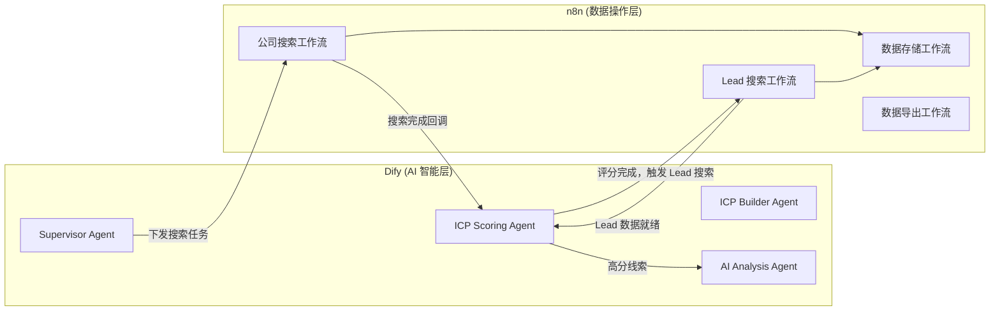
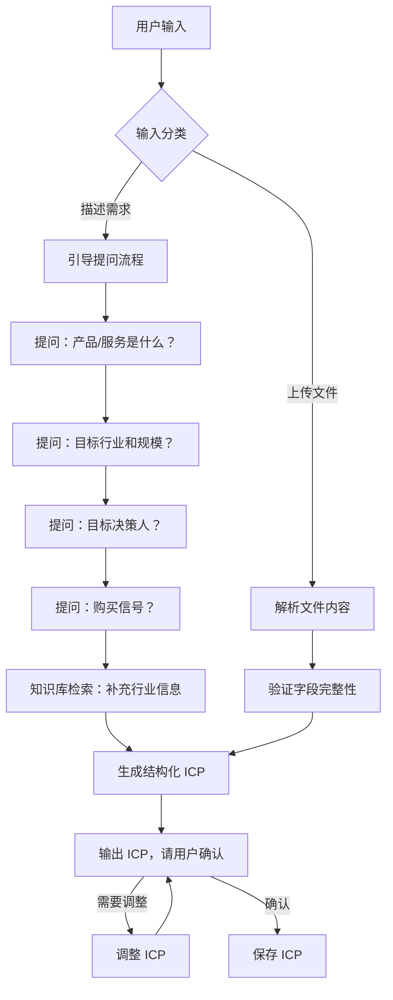
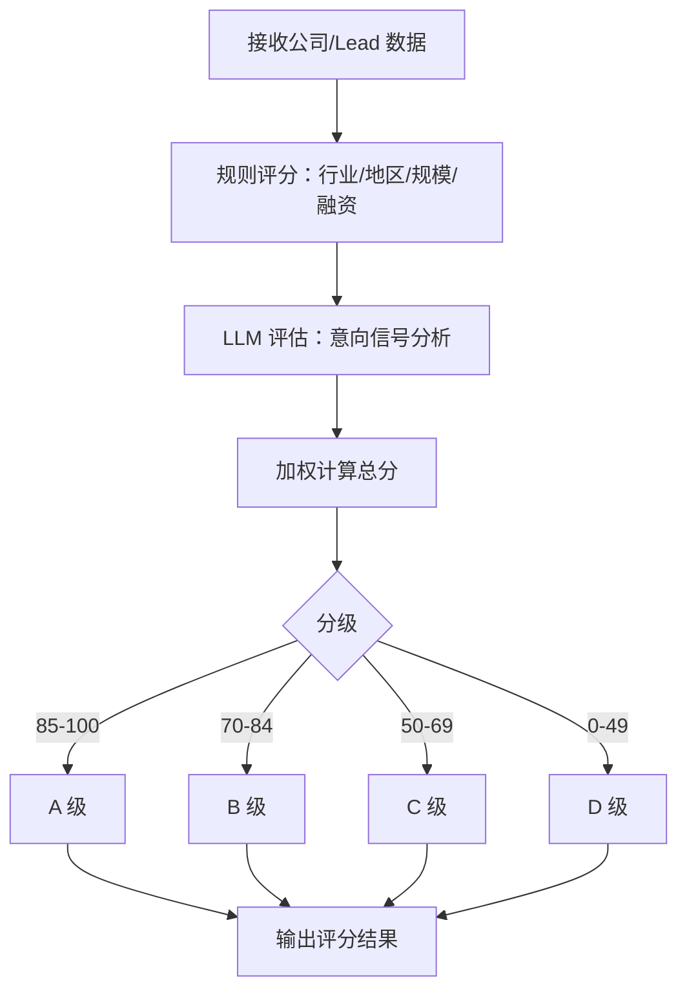
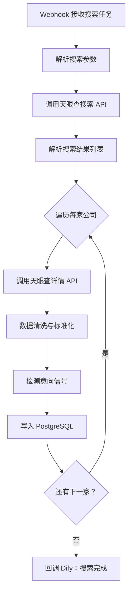
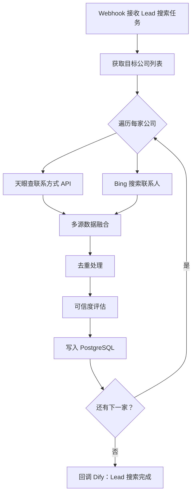

# 工作流引擎设计

## 概述

LeadKits 的业务逻辑通过 **Dify + n8n** 双引擎协作实现：

- **Dify**：负责所有需要 LLM 参与的智能处理（ICP 构建、评分、分析）
- **n8n**：负责所有数据获取、处理、存储的自动化流程（API 调用、数据清洗、存储）



## Dify Agent 详细设计

### Agent 1：ICP Builder

| 配置项 | 说明 |
|--------|------|
| **类型** | 对话型 Chatflow |
| **触发方式** | 前端 Dify API 直接调用 |
| **输入** | 用户自然语言描述 |
| **输出** | 结构化 ICP JSON |
| **知识库** | ICP 最佳实践、行业采购结构链、行业分类、行业与产业关联 |
| **LLM** | GPT-4 / Claude |

**Chatflow 设计**：



### Agent 2：Supervisor

| 配置项 | 说明 |
|--------|------|
| **类型** | Workflow（非对话） |
| **触发方式** | 前端 API 调用 |
| **输入** | ICP JSON |
| **输出** | 搜索任务列表（JSON） |
| **工具** | HTTP 请求（触发 n8n Webhook） |
| **LLM 角色** | 分析 ICP，拆分为可执行的搜索策略 |

**主要逻辑**：
1. 接收确认的 ICP
2. LLM 分析 ICP 属性，生成搜索策略（如何组合关键词、如何分批搜索）
3. 通过 HTTP Request 工具调用 n8n Webhook，传递搜索参数
4. 等待 n8n 回调，协调后续流程

### Agent 3：ICP Scoring

| 配置项 | 说明 |
|--------|------|
| **类型** | Workflow（非对话） |
| **触发方式** | n8n 回调触发 |
| **输入** | ICP 基准 + 公司/Lead 数据 |
| **输出** | 各维度得分 + 总分 + 等级 + 理由 |
| **LLM 角色** | 评估意向信号、模糊匹配判断 |
| **规则引擎** | 硬指标（行业/地区/规模）用 Code 节点计算 |

**评分流程**：



### Agent 4：AI Analysis

| 配置项 | 说明 |
|--------|------|
| **类型** | Workflow（非对话） |
| **触发方式** | 评分完成后触发（仅 A/B 级） |
| **输入** | 公司详情 + Lead 信息 + 评分结果 |
| **输出** | 结构化分析报告 JSON |
| **知识库** | B2B 销售方法论、话术模版 |
| **LLM** | GPT-4 / Claude（需要强推理） |

## n8n 工作流详细设计

### 工作流 1：公司搜索



**关键配置**：
- Webhook 节点：接收 Dify Supervisor 的搜索请求
- HTTP Request 节点：调用天眼查 API
- Code 节点：数据清洗、信号检测
- Postgres 节点：数据写入
- 错误处理：API 限流重试、异常数据跳过

### 工作流 2：Lead 搜索



### 工作流 3：数据存储

通用的数据写入工作流，被其他工作流调用：
- 数据校验
- 去重检查
- 批量插入/更新
- 写入日志

### 工作流 4：数据导出

- 接收导出请求（筛选条件 + 导出字段）
- 从 PostgreSQL 查询数据
- 生成 CSV/Excel 文件
- 返回下载链接

## Dify ↔ n8n 通信方式

| 方向 | 方式 | 说明 |
|------|------|------|
| Dify → n8n | HTTP Webhook | Dify 的 HTTP Request 工具调用 n8n Webhook URL |
| n8n → Dify | HTTP API | n8n 的 HTTP Request 节点调用 Dify API 触发工作流 |
| 共享数据 | PostgreSQL | 两者共用同一数据库，通过数据库交换复杂数据 |

## 环境配置

```yaml
# docker-compose.yml 示例
services:
  dify:
    image: langgenius/dify
    ports:
      - "3000:3000"
    environment:
      - DATABASE_URL=postgresql://...

  n8n:
    image: n8nio/n8n
    ports:
      - "5678:5678"
    environment:
      - DB_TYPE=postgresdb
      - DB_POSTGRESDB_HOST=...

  postgres:
    image: postgres:16
    ports:
      - "5432:5432"
```
