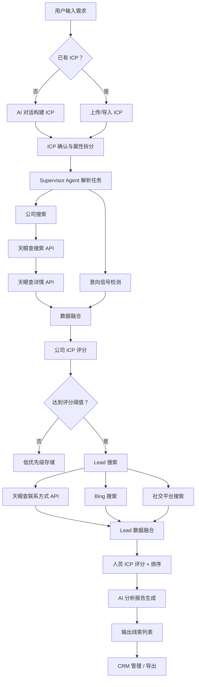
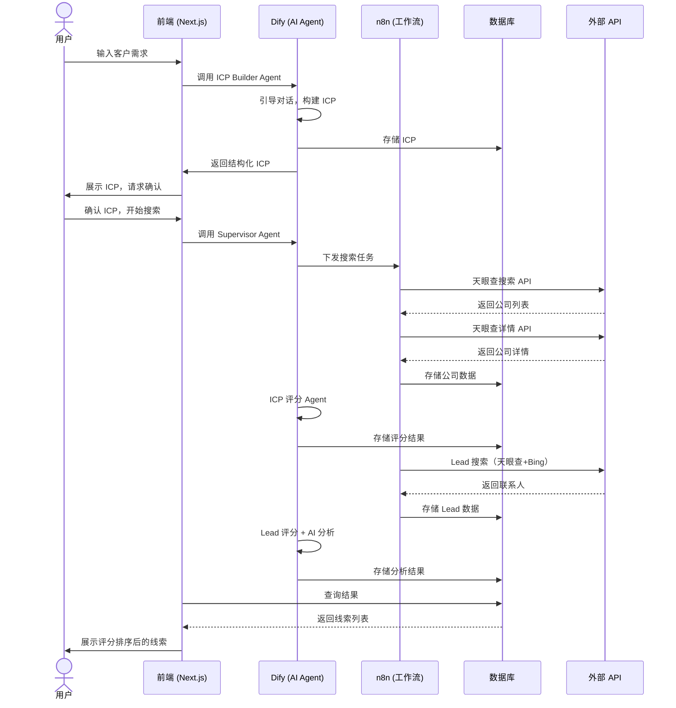

# 核心用户流程

## 端到端获客流程

从用户输入到获得可行动的线索列表，LeadKits 的核心流程如下：

## 各阶段详细说明

### 阶段 1：ICP 定义

| 步骤 | 操作 | 系统行为 |
|------|------|----------|
| 1.1 | 用户选择「构建 ICP」或「上传 ICP」 | 进入对应流程 |
| 1.2a | AI 对话模式：用户描述目标客户 | ICP Builder Agent 引导提问，结构化输出 ICP |
| 1.2b | 上传模式：用户上传 ICP 文件 | 系统解析并结构化 |
| 1.3 | 用户确认/调整 ICP | ICP 存储至数据库 |

### 阶段 2：企业搜索

| 步骤 | 操作 | 系统行为 |
|------|------|----------|
| 2.1 | 系统自动从 ICP 拆分搜索属性 | Supervisor Agent 生成搜索策略 |
| 2.2 | 调用天眼查搜索 API | n8n 工作流执行批量搜索 |
| 2.3 | 调用天眼查详情 API | 获取每家公司的详细信息 |
| 2.4 | 意向信号检测 | 分析招聘、融资、技术选型等信号 |
| 2.5 | 数据融合 + ICP 评分 | AI Agent 对每家公司评分 |

### 阶段 3：Lead 发现

| 步骤 | 操作 | 系统行为 |
|------|------|----------|
| 3.1 | 对评分达标的公司搜索 Lead | n8n 触发 Lead 搜索工作流 |
| 3.2 | 天眼查联系方式 API | 获取企业高管信息 |
| 3.3 | Bing 搜索 | 搜索公开联系信息 |
| 3.4 | 社交平台搜索 | 补充社交账号信息 |
| 3.5 | Lead 数据融合 + 评分排序 | AI Agent 评分并按优先级排序 |

### 阶段 4：分析与输出

| 步骤 | 操作 | 系统行为 |
|------|------|----------|
| 4.1 | AI 分析报告生成 | 为每个 Lead 生成分析摘要 |
| 4.2 | 展示线索列表 | 按评分排序，展示公司+Lead+分析 |
| 4.3 | 用户操作 | 加入 CRM / 导出 / 标记状态 |

## 系统交互流程图

