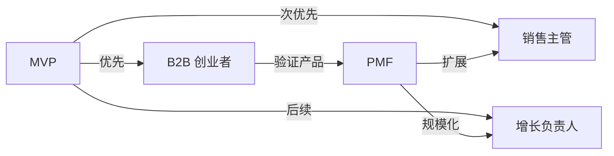

# 目标用户画像

## 核心用户角色

### 角色 1：B2B 创业者 / 独立创始人

| 维度 | 描述 |
|------|------|
| **公司阶段** | 种子轮/天使轮，5-20 人团队 |
| **个人背景** | 通常是技术或产品背景，非销售出身 |
| **核心痛点** | 没有专职 SDR，需要自己做获客；不知道目标客户在哪里；工具太多太贵 |
| **核心需求** | 一个人就能跑通获客全流程；低成本；操作简单不需要销售经验 |
| **使用频率** | 每周 2-3 次，集中做一批线索 |
| **付费意愿** | ¥100-300/月 |

**典型场景**：
> 小王是一家 SaaS 创业公司的技术合伙人，团队 10 个人，没有销售团队。他需要每周找到 50 家潜在客户公司和关键决策人，但不知道从哪里开始。目前他在天眼查搜公司、在领英找人、用 Excel 管理线索，效率很低。

---

### 角色 2：销售主管 / 销售经理

| 维度 | 描述 |
|------|------|
| **公司阶段** | A 轮/B 轮，50-200 人团队 |
| **个人背景** | 5+ 年销售经验，管理 3-10 人小团队 |
| **核心痛点** | 团队线索来源不统一；无法量化评估线索质量；没有系统化的获客流程 |
| **核心需求** | 统一的线索管理平台；智能评分帮助团队聚焦；可追踪的获客数据 |
| **使用频率** | 每天使用，管理团队获客工作 |
| **付费意愿** | ¥300-800/月 |

**典型场景**：
> 张经理带着 5 个 SDR，每人每天需要找 30 条线索。但每个人搜索方法不同，线索质量参差不齐。他需要一个平台来统一搜索标准（ICP）、自动评估线索质量、追踪团队产出。

---

### 角色 3：增长 / 市场负责人

| 维度 | 描述 |
|------|------|
| **公司阶段** | B 轮及以上，200+ 人团队 |
| **个人背景** | 市场营销背景，负责 MQL 生成 |
| **核心痛点** | 需要规模化生成高质量线索；缺少数据驱动的获客分析；ABM 策略落地难 |
| **核心需求** | 大批量线索生成；ICP 匹配评分；数据分析驱动优化 |
| **使用频率** | 每天使用，关注数据看板 |
| **付费意愿** | ¥800+/月 |

**典型场景**：
> 李总监负责公司的获客增长，需要每月为销售团队输送 500+ 条 MQL。她需要基于 ICP 批量筛选目标企业，用 AI 评分筛选高质量线索，并通过数据看板持续优化获客策略。

---

## 用户优先级（MVP）

MVP 阶段优先服务**角色 1（B2B 创业者）**：

1. 这类用户对工具碎片化的痛感最强
2. 决策链短，一个人就能决定是否使用
3. 对价格敏感但愿意为提效付费
4. 使用反馈快，有助于快速迭代

